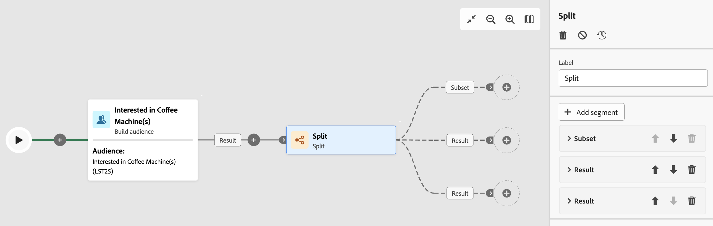

# División {#split}

>[!CONTEXTUALHELP]
>id="acw_orchestration_split"
>title="Actividad de división"
>abstract="La actividad **División** permite segmentar las poblaciones entrantes en varios subconjuntos en función de diferentes criterios de selección, como las reglas de filtrado o el tamaño de la población."

La **actividad dividida** es una **actividad de segmentación** que segmenta las poblaciones entrantes en varios subconjuntos en función de diferentes criterios de selección, como las reglas de filtrado o el tamaño de la población.

## Configuración de la actividad división {#split-configuration}

>[!CONTEXTUALHELP]
>id="acw_orchestration_split_segments"
>title="Segmentos para la actividad división"
>abstract="añadir tantos subconjuntos como desee para segmento la población entrante. Cuando se ejecuta la **actividad dividida** , la población se segmenta entre los diferentes subconjuntos en el orden en que se agregan al actividad. Antes de iniciar el flujo de trabajo, asegúrese de haber ordenado los subconjuntos en el orden que mejor se adapte a sus necesidades mediante los botones de flecha."

>[!CONTEXTUALHELP]
>id="acw_orchestration_split_filter"
>title="Filtro de la actividad de división"
>abstract="Para aplicar una condición de filtrado al subconjunto, haga clic en **[!UICONTROL Crear filtro]** y configure la regla de filtrado que desee mediante el modelador de consultas. Por ejemplo, incluya perfiles de la población entrante cuya dirección correo electrónico exista en la base de datos."
>additional-url="https://experienceleague.adobe.com/es/docs/campaign-web/v8/query-database/query-modeler-overview" text="Trabajar con el modelador de consultas"

>[!CONTEXTUALHELP]
>id="acw_orchestration_split_limit"
>title="Límite de la actividad división"
>abstract="Para limitar el número de perfiles seleccionados por el subconjunto, active la opción **[!UICONTROL Habilitar límite]** y especifique el número o los porcentajes de la población que desea incluir."

>[!CONTEXTUALHELP]
>id="acw_orchestration_split_sorting"
>title="Ordenación de la actividad división"
>abstract="Al establecer un límite de población para un subconjunto, puede clasificar los perfiles seleccionados en función de un atributo de perfil específico, en orden ascendente o descendente. Para ello, active la opción **Habilitar ordenación**. Por ejemplo, puede restringir un subconjunto para incluir solo los 50 perfiles con la cantidad de compra más alta."

>[!CONTEXTUALHELP]
>id="acw_orchestration_split_complement"
>title="Dividir generar complemento"
>abstract="Una vez configurados todos los subconjuntos, puede seleccionar la población restante que no coincide con ninguno de los subconjuntos e incluirlos en una transición saliente adicional. Para ello, active la opción **Generar complemento**."

>[!CONTEXTUALHELP]
>id="acw_orchestration_split_generatesubsets"
>title="Generar todos los subconjuntos en la misma tabla"
>abstract="Active esta opción para agrupar todos los subconjuntos en una sola transición de salida."

>[!CONTEXTUALHELP]
>id="acw_orchestration_split_emptytransition"
>title="Omitir transición vacía"
>abstract="Active la opción **[!UICONTROL Omitir transición vacía]** para deshabilitar la transición de salida para este subconjunto si la población entrante está vacía."

>[!CONTEXTUALHELP]
>id="acw_orchestration_split_enable_overlapping"
>title="Habilitar superposición de poblaciones de salida"
>abstract="La opción **[!UICONTROL Habilitar superposición de poblaciones de salida]** permite administrar poblaciones que pertenecen a varios subconjuntos. Cuando la casilla no está marcada, la actividad dividida garantiza que un destinatario no pueda estar presente en varias transiciones de salida, igualado si cumple con los criterios de varios subconjuntos. Los destinatarios se encuentran en el destino de la primera pestaña con criterios coincidentes. Cuando se selecciona el cuadro, los destinatarios se pueden encontrar en varios subconjuntos si cumplen con sus criterios de filtro. Adobe Campaign recomienda utilizar criterios exclusivos."

Siga estos pasos para configurar la actividad **División**:

1. Añada una actividad **División** al flujo de trabajo.

1. El panel de configuración de actividad se abre con un subconjunto predeterminado. Haga clic en el botón **Añadir segmento** para añadir tantos subconjuntos como desee para segmentar la población entrante.

   

   >[!IMPORTANT]
   >
   >Cuando se ejecuta la **actividad dividida** , la población se segmenta entre los diferentes subconjuntos en el orden en que se agregan al actividad. Por ejemplo, si el primer subconjunto recupera el 70 % de la población inicial, el siguiente subconjunto añadido aplicará sus criterios de selección solo al 30 % restante, y así sucesivamente.
   >
   >Antes de comenzar su flujo de trabajo, asegúrese de haber ordenado los subconjuntos en el orden que se adapte a sus necesidades. Utilice los botones de flecha para cambiar la posición de un subconjunto.

1. Una vez creados los subconjuntos, la actividad muestra de forma predeterminada tantas transiciones de salida como subconjuntos. Cambie la etiqueta de cada subconjunto para identificarlos fácilmente en el lienzo del flujo de trabajo.

1. Configure cómo cada subconjunto filtros la población entrante. Siga estos pasos:

   1. Abra el subconjunto para mostrar sus propiedades.

   1. Para aplicar una condición de filtrado al subconjunto, haga clic en **[!UICONTROL Crear filtro]** y configure la regla de filtrado que desee mediante el modelador de consultas. Por ejemplo, incluya perfiles de la población entrante cuya dirección correo electrónico exista en la base de datos. [Aprenda a trabajar con el consulta modelador](../../query/query-modeler-overview.md).

   1. Para limitar el número de perfiles seleccionados por el subconjunto, active la opción **[!UICONTROL Habilitar límite]** y especifique el número o los porcentajes de la población que desea incluir.

   1. Para deshabilitar un transición si la población entrante está vacía, active la **[!UICONTROL opción Omitir vacío transición]** . Si ninguna perfil coincide con el subconjunto, el flujo de trabajo no transición al siguiente actividad.

      

      >[!NOTE]
      >
      >Al establecer un límite de población para un subconjunto, puede clasificar los perfiles seleccionados en función de un atributo[&#128279;](../../get-started/attributes.md) perfil específico, en orden ascendente o de bajada. Para ello, active la opción **[!UICONTROL Habilitar ordenación]**. Por ejemplo, puede restringir un subconjunto para incluir solo los 50 perfiles con la cantidad de compra más alta.

1. Una vez configurados todos los subconjuntos, puede seleccionar la población restante que no coincide con ninguno de los subconjuntos e incluirlos en una transición saliente adicional. Para ello, active la opción **[!UICONTROL Generar complemento]**.

   

   >[!NOTE]
   >
   >La **[!UICONTROL opción Generar todos los subconjuntos en la misma tabla]** permite grupo todos los subconjuntos en un único transición de salida.

1. La opción **[!UICONTROL Enable overlapping of output populations]** permite administrar poblaciones que pertenecen a varios subconjuntos:

   * Cuando la casilla no está marcada, la actividad dividida garantiza que un destinatario no pueda estar presente en varias transiciones de salida, igualado si cumple con los criterios de varios subconjuntos. Los destinatarios se encuentran en el destino de la primera pestaña con criterios coincidentes.
   * Cuando se selecciona el cuadro, los destinatarios se pueden encontrar en varios subconjuntos si cumplen con sus criterios de filtro. Adobe Campaign recomienda utilizar criterios exclusivos.

La actividad está configurada. En flujo de trabajo ejecución, la población se segmenta en los diferentes subconjuntos en el orden en que se han agregado al actividad.

## Ejemplo {#split-example}

En el ejemplo siguiente, la **[!UICONTROL función Dividir]** actividad segmenta una audiencia en subconjuntos distintos según el canal de comunicación que se va a utilizar:

* **Subconjunto 1 &quot;push&quot;**: Este subconjunto comprende todos los perfiles que han instalado el aplicación móvil.
* **Subconjunto 2 &quot;sms&quot;**: Usuarios de teléfonos móviles: Para la población restante que no cayó en el Subconjunto 1, el Subconjunto 2 aplica un regla de filtrado para seleccionar perfiles con teléfonos móviles en la base de datos.
* **Transición de complemento**: esta transición captura todos los perfiles restantes que no coinciden con el subconjunto 1 o el subconjunto 2. Específicamente, incluye perfiles que no han instalado la aplicación móvil ni tienen teléfono móvil, como usuarios que no han instalado la aplicación móvil o que carecen de un número de móvil registrado.

