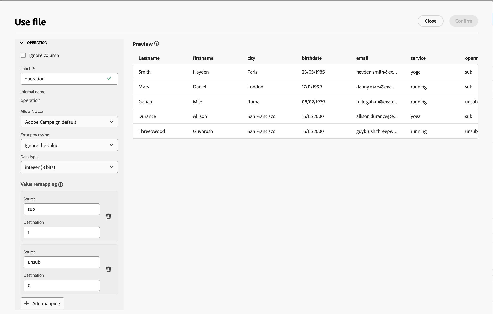

# Servicios de suscripción {#subscriptipon-services}

>[!CONTEXTUALHELP]
>id="acw_orchestration_subscription"
>title="Actividad de los servicios de suscripción"
>abstract="La actividad Servicios de suscripción permite suscribirse o darse de baja en varios perfiles de un servicio en una sola acción."

>[!CONTEXTUALHELP]
>id="acw_orchestration_subscription_general"
>title="Parámetros generales del servicio de suscripción"
>abstract="Elija el servicio deseado y elija la acción que desea realizar (suscripción o baja). Active la opción **Enviar mensaje de confirmación** para notificar a la población de que se ha suscrito o dado de baja del servicio seleccionado."

>[!CONTEXTUALHELP]
>id="acw_orchestration_subscription_outboundtransition"
>title="Generar una transición saliente"
>abstract="Alterne la opción **Generar una transición saliente** para añadir una transición después de la actividad."

El **Servicios de suscripción** la actividad es una **Administración de datos** actividad. Permite crear o eliminar una suscripción a un servicio informativo para la población especificada en la transición.

## Configure la actividad Subscription services {#subscription-services-configuration}

Siga estos pasos para configurar el **Servicios de suscripción** actividad:

1. Añadir un **Servicios de suscripción** en el flujo de trabajo. Puede utilizar esta actividad después de segmentar perfiles o importar un archivo con datos identificados.

1. Seleccione el servicio para el que desea administrar las suscripciones mediante una de las siguientes opciones:

   * **[!UICONTROL Seleccione un servicio específico]**: Seleccione manualmente un servicio utilizando **[!UICONTROL Servicio]** field.

   * **[!UICONTROL Desde transición entrante]**: utilice el servicio especificado en la transición entrante. Por ejemplo, puede importar un archivo que especifique el servicio que se va a administrar para cada línea. El servicio en el que se realiza la operación se selecciona dinámicamente para cada perfil.

   

1. Seleccione la operación que desea realizar: **Suscribirse** o **Cancelar suscripción**.

   Si el servicio se define en la transición entrante, puede elegir cómo recuperar esta operación:

   * **Seleccione un tipo de operación específico**: Seleccione manualmente la operación que desea realizar (**Suscribirse** o **Cancelar suscripción**)

   * **Seleccionar un tipo de operación de una ruta de transición entrante**: seleccione la columna de los datos de entrada que especifica la operación que se realizará para cada registro. Por ejemplo, puede importar un archivo que especifique la operación que se va a realizar para cada línea en una columna &quot;operación&quot;.

     >[!NOTE]
     >
     >Aquí solo se pueden seleccionar campos booleanos o enteros. Asegúrese de que los datos que contienen la operación que se va a realizar coinciden con este formato. Por ejemplo, si está cargando datos desde una actividad de Cargar archivo, compruebe que ha establecido correctamente el formato de la columna que contiene la operación en **[!UICONTROL Cargar archivo]** actividad. Se presenta un ejemplo en [esta sección](#uc2).

   

1. Para notificar a los destinatarios que se han suscrito o dado de baja del servicio seleccionado, cambie el **[!UICONTROL Enviar un mensaje de confirmación]** opción activada. El contenido de esta notificación se define en una plantilla de envío asociada al servicio de información.

1. Si utiliza datos de una transición entrante, se debe crear un **[!UICONTROL Información adicional]** se muestra esta sección, que le permite especificar los datos y el origen de la suscripción para cada registro. Puede dejar esta sección vacía, en cuyo caso no se definirá ninguna fecha ni ningún origen al ejecutar el flujo de trabajo.

   * Si los datos de entrada contienen una columna que indica la fecha de suscripción del perfil al servicio, puede seleccionarla en la **[!UICONTROL Fecha]** field.

   * En el **[!UICONTROL Ruta de origen]** , defina el origen de la suscripción. Puede establecerlo en uno de los campos de los datos de entrada o en un valor constante de su elección marcando la variable **[!UICONTROL Establecer una constante como origen]** opción.

   

1. Para añadir una transición saliente después de la actividad, cambie el **[!UICONTROL Generación de una transición saliente]** opción activada.

## Ejemplos {#example}

### Suscripción de una audiencia a un servicio específico {#uc1}

Este flujo de trabajo siguiente muestra cómo suscribir una audiencia a un servicio existente.


* A **[!UICONTROL Crear audiencia]** la actividad se dirige a una audiencia existente.

* A **[!UICONTROL Servicios de suscripción]** La actividad de permite seleccionar el servicio al que se deben suscribir los perfiles.

<!--
### Updating multiple subscription statuses from a file {#uc2}

The workflow below shows how to import a file containing profiles and update their subscription to several services specified in the file.


* A **[!UICONTROL Load file]** activity loads a CSV file containing the data and defines the structure of the imported columns. The "service" and "operation" columns specify the service to update and the operation to perform (subscription or unsubscription).

  ```
  Lastname,firstname,city,birthdate,email,service,operation
  Smith,Hayden,Paris,23/05/1985,hayden.smith@example.com,yoga,sub
  Mars,Daniel,London,17/11/1999,danny.mars@example.com,running,sub
  Smith,Clara,Roma,08/02/1979,clara.smith@example.com,running,unsub
  Durance,Allison,San Francisco,15/12/2000,allison.durance@example.com,yoga,sub
  Durance,Alison,San Francisco,15/12/2000,allison.durance@example.com,running,unsub
  ```

  As you may have noticed, the operation is specified in the file as "sub" or "unsub". The system expects a **Boolean** or **Integer** value to recognize the operation to perform: "0" to unsubscribe and "1" to subscribe. To match this requirement, a remapping of values must be performed in the detail of the "operation" column in the sample file configuration screen.

  

  If your file already uses "0" and "1" to identify the operation, you don't need to remap those values. Only make sure that the column is processed as a **Boolean** or **Integer** in the sample file columns.

* A **[!UICONTROL Reconciliation]** activity identifies the data from the file as belonging to the profile dimension of the Adobe Campaign database. The **email** field of the file is matched to the **email** field of the profile resource.

  

* An **[!UICONTROL Enrichment]** activity creates a link to the "Services (nms)" table and creates a simple join between the "service" column of the uploaded file, and the services "internal name" field in the database.

    

* A **[!UICONTROL Deduplication]** based on the **email** field identifies duplicates. It is important to eliminate duplicates since the subscription to a service will fail for all data in case of duplicates.

  
  
* A **[!UICONTROL Subscription Services]** identifies the services to update as coming from the transition, through the link created in the **[!UICONTROL Reconciliation]** activity.

  The **[!UICONTROL Operation type]** is identified as coming from the **operation** field of the file. Only Boolean or Integer fields can be selected here. If the column of your file that contains the operation to perform does not appear in the list, make sure that you have correctly set your column format in the **[!UICONTROL Load file]** activity, as explained earlier in this example.

  -->
