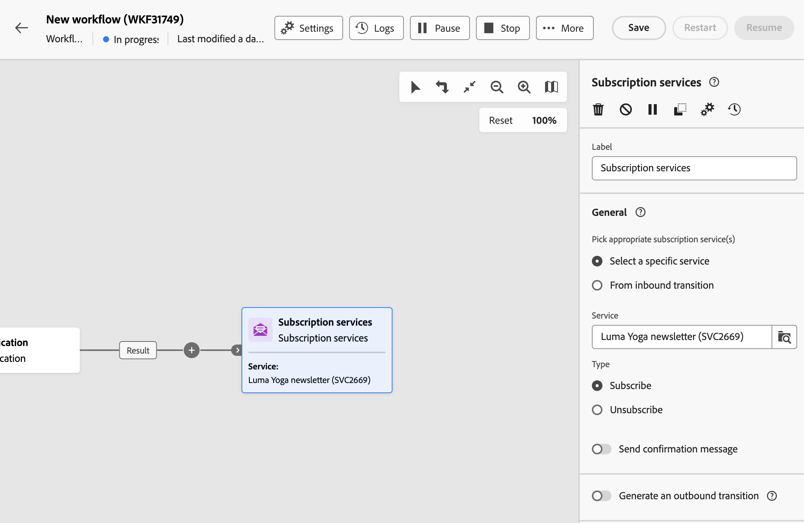
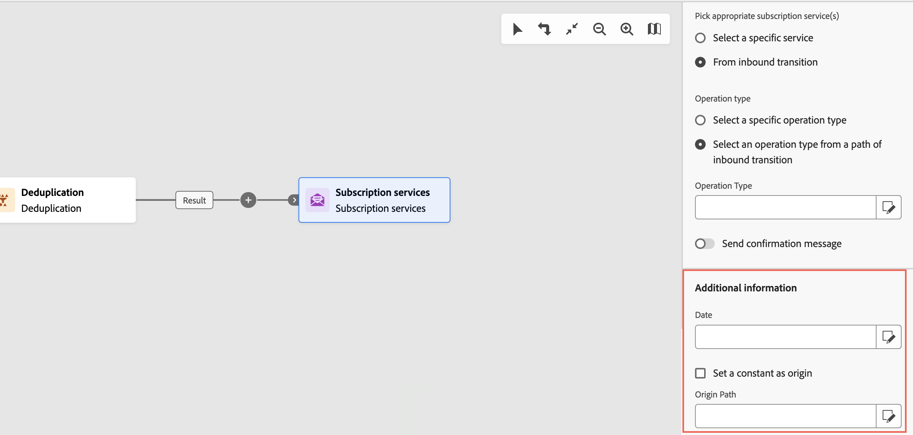

# Servicios de suscripción {#subscription-services}

>[!CONTEXTUALHELP]
>id="acw_orchestration_subscription"
>title="Actividad Servicios de suscripción"
>abstract="La actividad Servicios de suscripción permite suscribir a un servicio o cancelar dicha suscripción de varios perfiles en una sola acción."

>[!CONTEXTUALHELP]
>id="acw_orchestration_subscription_general"
>title="Parámetros generales del servicio de suscripción"
>abstract="Elija el servicio deseado y elija la acción que desea realizar (suscribirse o cancelar la suscripción). Active la opción **Enviar mensaje de confirmación** para notificar a la población que se ha suscrito o cancelado la suscripción al servicio seleccionado."

>[!CONTEXTUALHELP]
>id="acw_orchestration_subscription_outboundtransition"
>title="Generar una transición saliente"
>abstract="Alterne la opción **Generar una transición saliente** para añadir una transición después de la actividad."

>[!CONTEXTUALHELP]
>id="acw_orchestration_subscription_additionalinfo"
>title="Más información"
>abstract="Especifique los datos y el origen de la suscripción para cada registro. Puede dejar esta sección vacía, en cuyo caso no se definirá ninguna fecha ni ningún origen al ejecutar el flujo de trabajo. Si los datos de entrada contienen una columna que indica la fecha de suscripción del perfil al servicio, puede seleccionarla en el campo **[!UICONTROL Fecha]**. En el campo **[!UICONTROL Ruta de origen]**, defina el origen de la suscripción. Puede definirlo en uno de los campos de los datos de entrada o en un valor constante de su elección marcando la opción **[!UICONTROL Establecer un valor constante como origen]**. "

La **actividad de servicios** de suscripción es un **actividad de administración de** datos. Permite crear o eliminar una suscripción a una servicio informativo para la población especificada en el transición.

## Configurar los servicios de suscripción actividad {#subscription-services-configuration}

Siga estos pasos para configurar la actividad **Servicios de suscripción**:

1. Agregue una actividad **Servicios de suscripción** a su flujo de trabajo. Puede utilizar esta actividad después de segmentar perfiles o importar un archivo con datos identificados.

1. Seleccione el servicio para el que desea administrar las suscripciones mediante una de las siguientes opciones:

   * **[!UICONTROL Seleccionar un servicio específico]**: Seleccione manualmente un servicio mediante el campo **[!UICONTROL Servicio]**.

   * **[!UICONTROL De transición entrante]**: use el servicio especificado en la transición entrante. Por ejemplo, puede importar un archivo que especifique el servicio que se va a administrar para cada línea. El servicio en el que se realiza la operación se selecciona dinámicamente para cada perfil.

   

1. Seleccione la operación que desea realizar: **Suscribirse** o **Cancelar la suscripción**.

   Si el servicio se define en la transición entrante, elija cómo recuperar esta operación:

   * **Seleccionar un tipo de operación específico**: Seleccione manualmente la operación que desea realizar (**Suscribirse** o **Cancelar la suscripción**).

   * **Seleccione un tipo de operación de una ruta de transición entrante**: seleccione la columna de los datos entrantes que especifica la operación que se realizará para cada registro. Por ejemplo, puede importar un archivo que especifique la operación que se va a realizar para cada línea en una columna &quot;operación&quot;.

     Aquí solo se pueden seleccionar campos booleanos o enteros. Asegúrese de que los datos que contienen la operación que se va a realizar coinciden con este formato. Por ejemplo, si está cargando datos desde una actividad de Cargar archivo, compruebe que ha establecido correctamente el formato de la columna que contiene la operación en la actividad **[!UICONTROL Cargar archivo]**. Se presenta un ejemplo en [esta sección](#uc2).

     >[!CAUTION]
     >
     >De manera predeterminada, si selecciona esta opción, la actividad **Subscription services** espera tener una definición de vínculo a la tabla **Services (nms)** configurada en el flujo de trabajo. Para ello, asegúrese de haber configurado un vínculo de reconciliación en una **actividad de enriquecimiento** anterior en el flujo de trabajo. Hay disponible [aquí](#uc2) un ejemplo que muestra cómo usar esta opción.

   

1. Para notificar a los destinatarios que se han suscrito o dado de baja del servicio seleccionado, active la opción **[!UICONTROL Enviar un mensaje de confirmación]**. El contenido de este notificación se define en una plantilla de envíos asociada al servicio informativo.

1. Si está utilizando datos de un transición entrante, aparece una **[!UICONTROL sección de información]** adicional que le permite especificar los datos y el origen de la suscripción para cada registro. Puede dejar esta sección vacía, en cuyo caso no se establecerá ninguna fecha ni origen al ejecutar el flujo de trabajo.

   * Si los datos entrantes contienen una columna que indica la fecha de suscripción del perfil al servicio, puede seleccionarla en el **[!UICONTROL campo Fecha]** .

   * En el campo **[!UICONTROL Ruta de origen]**, defina el origen de la suscripción. Puede definirlo en uno de los campos de los datos de entrada o en un valor constante de su elección marcando la opción **[!UICONTROL Establecer un valor constante como origen]**. 

   

1. Para agregar una transición saliente después de la actividad, active la opción **[!UICONTROL Generar una transición saliente]**.

## Ejemplos {#example}

### Suscripción de una audiencia a un servicio específico {#uc1}

Este flujo de trabajo siguiente muestra cómo suscribir una audiencia a un servicio existente.


* Una actividad **[!UICONTROL Generar audiencia]** se dirige a una audiencia existente.

* Una actividad **[!UICONTROL Servicios de suscripción]** le permite seleccionar el servicio al que se deben suscribir los perfiles.

### Actualización de varios estados de suscripción de un archivo {#uc2}

El flujo de trabajo siguiente muestra cómo importar un archivo que contiene perfiles y actualizar su suscripción a varios servicios especificados en el archivo.


* Una actividad **[!UICONTROL Cargar archivo]** carga un archivo CSV que contiene los datos y define la estructura de las columnas importadas. Las columnas &quot;servicio&quot; y &quot;operación&quot; especifican el servicio que se va a actualizar y la operación que se va a realizar (suscripción o baja).

  ```
  Lastname,firstname,city,birthdate,email,service,operation
  Smith,Hayden,Paris,23/05/1985,hayden.smith@example.com,yoga,sub
  Mars,Daniel,London,17/11/1999,danny.mars@example.com,running,sub
  Smith,Clara,Roma,08/02/1979,clara.smith@example.com,running,unsub
  Durance,Allison,San Francisco,15/12/2000,allison.durance@example.com,yoga,sub
  Durance,Alison,San Francisco,15/12/2000,allison.durance@example.com,running,unsub
  ```

  Como habrás notado, la operación se especifica en el archivo como &quot;sub&quot; o &quot;unsub&quot;. El sistema espera que un valor **booleano** o **entero** reconozca la operación que se va a realizar: “0” para cancelar la suscripción y “1” para suscribirse. Para cumplir este requisito:
   * El **tipo** de datos de la columna &quot;operación&quot; se establece en entero.
   * Se debe realizar una **reasignación de valores** para que coincida con los valores &quot;sub&quot; y &quot;unsub&quot; con los valores &quot;1&quot; y &quot;0&quot;.

  

  Si el archivo ya utiliza “0” y “1” para identificar la operación, no es necesario volver a asignar esos valores. Solo asegúrese de que la columna se procese como **booleano** o **entero** en las columnas del archivo de muestra.

* Una actividad **[!UICONTROL Reconciliation]** identifica los datos del archivo como pertenecientes a la dimensión de perfil de la base de datos de Adobe Campaign. El campo **correo electrónico** del archivo coincide con el campo **correo electrónico** del recurso de perfil.

  

* Una actividad **[!UICONTROL Enrichment]** crea un vínculo de reconciliación con la tabla &quot;Services (nms)&quot;, con una simple unión entre la columna &quot;service&quot; del archivo cargado y el campo &quot;internal name&quot; de servicios en la base de datos.

  

* **[!UICONTROL Servicios de suscripción]** identifica los servicios que se van a actualizar como procedentes de la transición.

  El **[!UICONTROL tipo de operación]** se ha identificado como proveniente del campo **operation** del archivo. Aquí solo se pueden seleccionar los campos booleano o entero. Si la columna del archivo que contiene la operación que se va a realizar no aparece en la lista, asegúrese de que ha establecido correctamente el formato de columna en la actividad **[!UICONTROL Cargar archivo]**, tal como se explicó anteriormente en este ejemplo.

  