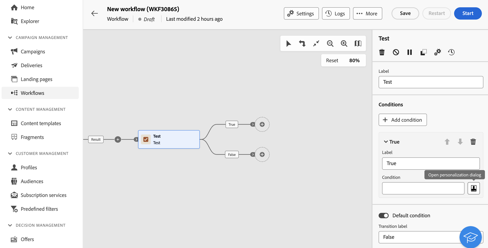

# Prueba {#test}

La actividad **Test** es una actividad **Flow control**. Permite habilitar transiciones en función de condiciones especificadas.

## Configuración de la actividad Test {#test-configuration}

Siga estos pasos para configurar la actividad **Test**:

1. Añada una actividad **Test** al flujo de trabajo.

1. De manera predeterminada, la actividad **[!UICONTROL Test]** presenta una prueba booleana simple. Si se cumple la condición definida en la transición &quot;True&quot;, se activa esta transición. De lo contrario, se activa una transición predeterminada &quot;False&quot;.

1. Para configurar la condición asociada a una transición, haga clic en el icono **[!UICONTROL Abrir cuadro de diálogo de personalización]**. Utilice el editor de expresiones para definir las reglas necesarias para activar esta transición. También puede aprovechar variables de eventos, condiciones y funciones de fecha y hora. [Aprenda a trabajar con variables de eventos y el editor de expresiones](../event-variables.md)

   Además, puede modificar el campo **[!UICONTROL Label]** para personalizar el nombre de la transición en el lienzo del flujo de trabajo.

   

1. Puede agregar varias transiciones de salida a una actividad **[!UICONTROL Test]**. Para ello, haga clic en el botón **[!UICONTROL Agregar condición]** y configure la etiqueta y la condición asociada para cada transición.

1. Durante la ejecución del flujo de trabajo, cada condición se prueba secuencialmente hasta que se cumpla una de ellas. Si no se cumple ninguna de las condiciones, el flujo de trabajo continúa en la ruta de la **[!UICONTROL condición predeterminada]**. Si no se activa ninguna condición predeterminada, los flujos de trabajo se detienen en este punto.

## Ejemplo {#example}

En este ejemplo, se activan diferentes transiciones en función del número de perfiles objetivo por una actividad **[!UICONTROL Generar audiencia]**:
* Si hay más de 10 000 perfiles de destino, se envía un mensaje de correo electrónico.
* Para entre 1000 y 10 000 perfiles, se envía un SMS.
* Si los perfiles objetivo caen por debajo de 1000, se les dirige a una transición de &quot;no contactar&quot;.

Para ello, la variable de evento `vars.recCount` se ha aprovechado en las condiciones &quot;correo electrónico&quot; y &quot;sms&quot; para contar el número de perfiles de destino y activar la transición adecuada.

