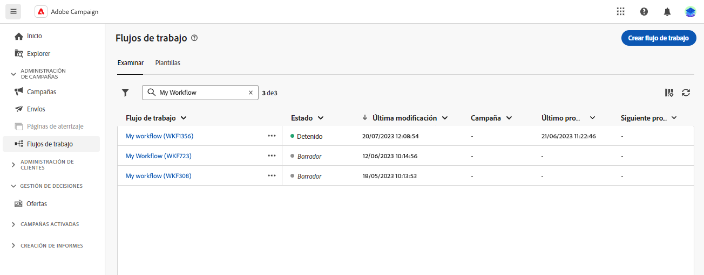
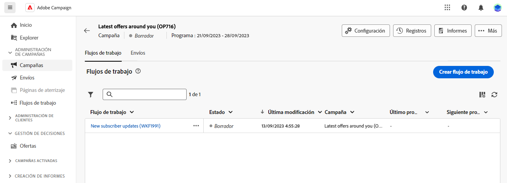

# Principios clave de la creación de un flujo de trabajo {#gs-workflow-creation}

Con Campaign v8 Web, puede crear flujos de trabajo en un lienzo visual para diseñar procesos multicanal como segmentación, ejecución de campañas o procesamiento de archivos.

## ¿Qué hay dentro de un flujo de trabajo? {#gs-workflow-inside}

El diagrama de flujo de trabajo es una representación de lo que se supone que debe suceder. Describe las diversas tareas que se realizan y cómo se relacionan entre sí.

 {zoomable=&quot;yes&quot;}

Cada flujo de trabajo contiene:

* **Actividades**: una actividad es una tarea que se va a realizar. Las distintas actividades disponibles se representan en el diagrama mediante iconos. Cada actividad tiene propiedades específicas y otras propiedades que son comunes a todas las actividades.

  En un diagrama de flujo de trabajo, una actividad determinada puede producir varias tareas, en particular cuando hay un bucle o una acción recurrente.

* **Transiciones**: las transiciones vinculan una actividad de origen a una actividad de destino y definen su secuencia.

* **Tablas de trabajo**: la tabla de trabajo contiene toda la información que transmite la transición. Cada flujo de trabajo utiliza varias tablas de trabajo. Los datos transmitidos en estas tablas se pueden utilizar en todo el ciclo de vida del flujo de trabajo.

## Pasos clave para crear un flujo de trabajo {#gs-workflow-steps}

Campañas ofrece dos formas de crear un flujo de trabajo:

1. Los flujos de trabajo se pueden crear como flujos de trabajo independientes a partir del menú **Flujos de trabajo**.

   

1. Los flujos de trabajo se pueden crear directamente dentro de una campaña, desde la pestaña **Flujo de trabajo** de la campaña. Cuando se incluye en una campaña, el flujo de trabajo se ejecuta junto con todos los flujos de trabajo de la otra campaña, y todas las métricas de creación de informes se agrupan en el nivel de campaña.

   

Los pasos principales para crear flujos de trabajo son los siguientes:

Estos pasos se detallan en la siguiente sección:

1. [Cree el flujo de trabajo y defina sus propiedades](create-workflow.md)
1. [Organice y configure actividades](orchestrate-activities.md)
1. [Realizar la configuración avanzada del flujo de trabajo](workflow-settings.md)
1. [Iniciar el flujo de trabajo y monitorizar su ejecución](start-monitor-workflows.md)
