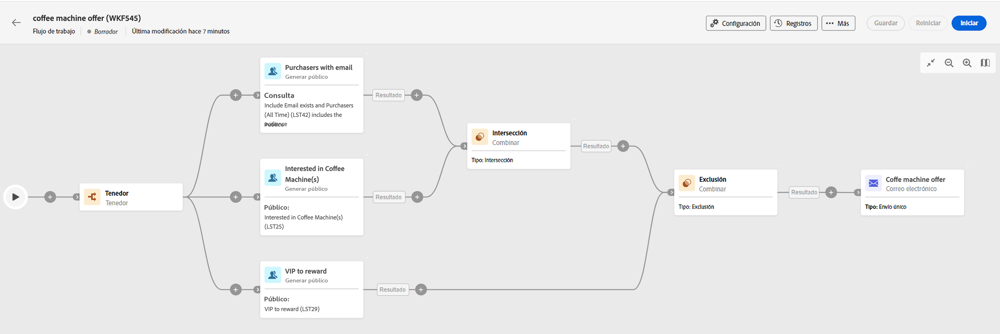

# Principios clave de la creación de un flujo de trabajo {#gs-workflow-creation}

Con Campaign v8 Web, puede crear flujos de trabajo en un lienzo visual para diseñar procesos multicanal como segmentación, ejecución de campañas o procesamiento de archivos.

Los flujos de trabajo se pueden crear como flujos de trabajo independientes desde el menú Flujos de trabajo o directamente dentro de una campaña, en cuyo caso el flujo de trabajo se vincula a la campaña y se ejecuta junto con todos los flujos de trabajo de la otra campaña.

## ¿Qué hay dentro de un flujo de trabajo?

El diagrama de flujo de trabajo es una representación de lo que se supone que debe suceder. Describe las diversas tareas que se deben realizar y cómo se vinculan entre sí.

Cada flujo de trabajo contiene:

* **Actividades**: una actividad es una tarea que se va a realizar. Las distintas actividades se representan en el diagrama mediante iconos. Cada actividad tiene propiedades específicas y otras propiedades que son comunes a todas las actividades.

   En un diagrama de flujo de trabajo, una actividad determinada puede producir varias tareas, en particular cuando hay un bucle o una acción recurrente.

* **Transiciones**: las transiciones vinculan una actividad de origen a una actividad de destino y definen su secuencia.

* **Tablas de trabajo**: la tabla de trabajo contiene toda la información que transmite la transición. Cada flujo de trabajo utiliza varias tablas de trabajo. Los datos transmitidos en estas tablas se pueden utilizar en todo el ciclo de vida del flujo de trabajo.

## Pasos principales para crear un flujo de trabajo

Los pasos principales para crear flujos de trabajo son los siguientes:

<table style="table-layout:fixed"><tr style="border: 0;">
<td>

<a href="create-workflow.md#create"><strong>Creación del flujo de trabajo</strong>

</td>
<td>

<a href="create-workflow.md#build"><strong>Organización de actividades</strong></a>

</td>
<td>

<a href="workflow-settings.md"><strong>Configuración avanzada (opcional)</strong></a>

</td>
<td>

<a href="start-monitor-workflows.md"><strong>Inicio y monitorización de la ejecución del flujo de trabajo</strong></a>

</td>
</tr></table>