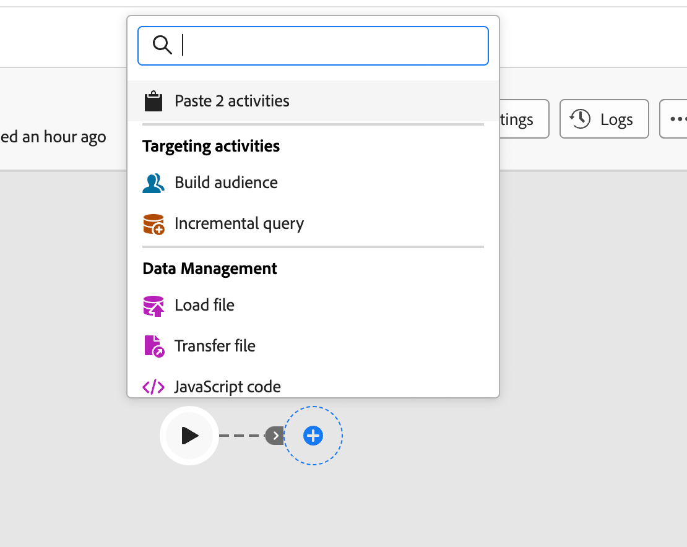

# Organización de actividades {#orchestrate}

Una vez que haya [creado un flujo de trabajo](create-workflow.md), ya sea desde el menú de flujo de trabajo o dentro de una campaña, puede empezar a organizar las diferentes tareas que realiza. Para ello, se proporciona un lienzo visual, que le permite construir un diagrama de flujo de trabajo. Dentro de este diagrama, puede añadir varias actividades y conectarlas en un orden secuencial.

## Añadir actividades {#add}

En esta fase de la configuración, el diagrama se muestra con un icono de inicio que representa el principio del flujo de trabajo. Para agregar su primera actividad, haga clic en el botón **+** conectado al icono de inicio.

Aparecerá una lista de actividades que se pueden agregar al diagrama. Las actividades disponibles dependen de su posición en el diagrama de flujo de trabajo. Por ejemplo, al agregar la primera actividad, puede iniciar el flujo de trabajo segmentando una audiencia, dividiendo la ruta del flujo de trabajo o estableciendo una actividad **Wait** para retrasar la ejecución del flujo de trabajo. Después de una actividad **Generar audiencia**, puede refinar el segmento con actividades de segmentación, enviar una entrega a la audiencia con actividades de canal u organizar el proceso de flujo de trabajo con actividades de control de flujo.

{zoomable="yes"}

Una vez que se agrega una actividad al diagrama, aparece un panel derecho que le permite configurar la actividad recién agregada con ajustes específicos. Encontrará información detallada sobre cómo configurar cada actividad en [esta sección](activities/about-activities.md).

{zoomable="yes"}

Repita este proceso para agregar tantas actividades como sea necesario, según las tareas que realice el flujo de trabajo. También puede insertar una nueva actividad entre dos actividades. Para ello, haga clic en el botón **+** en la transición entre las actividades, seleccione la actividad deseada y configúrela en el panel derecho.

Para quitar una actividad, selecciónela en el lienzo y haga clic en el icono **Eliminar** en las propiedades de la actividad.

>[!TIP]
>
>Puede personalizar el nombre de las transiciones entre cada actividad. Para ello, seleccione la transición y cambie su etiqueta en el panel derecho.

## La barra de herramientas {#toolbar}

La barra de herramientas, situada en la esquina superior derecha del lienzo, proporciona opciones para manipular fácilmente las actividades y navegar en el lienzo:

* **Modo de selección múltiple**: seleccione varias actividades para eliminarlas todas a la vez o cópielas y péguelas. Consulte [esta sección](#copy).
* **Rotar**: cambie el lienzo verticalmente.
* **Ajustar a pantalla**: adapta el nivel de zoom del lienzo a la pantalla.
* **Alejar** / **Acercar**: Aleja o en el lienzo.
* **Mostrar mapa**: abre una instantánea del lienzo que muestra tu ubicación.

{zoomable="yes"}{width="50%"}

## Administrar actividades {#manage}

Al agregar actividades, los botones de acción están disponibles en el panel de propiedades, lo que le permite realizar varias operaciones.

{zoomable="yes"}

Puede hacer lo siguiente:

* **Eliminar** la actividad del lienzo.
* **Deshabilitar/Habilitar** la actividad. Cuando se ejecuta el flujo de trabajo, las actividades desactivadas y las siguientes actividades en la misma ruta no se ejecutan y el flujo de trabajo se detiene.
* **Pausar/reanudar** la actividad. Cuando se ejecuta el flujo de trabajo, se detiene en la actividad pausada. La tarea correspondiente, así como todas las que la siguen en la misma ruta, no se ejecutan.
* **Copie** la actividad. Consulte [esta sección](#copy).
* **Mover** una actividad y todos sus nodos secundarios a otra transición. Consulte [esta sección](#move).
* Acceda a las **opciones de ejecución** de la actividad.
* Acceda a los **registros y tareas** de la actividad.

Varias actividades **Targeting**, como **Combine** o **Deduplication**, le permiten procesar la población restante e incluirla en una transición saliente adicional. Por ejemplo, si está usando una actividad **Split**, el complemento consiste en la población que no coincide con ninguno de los subconjuntos definidos anteriormente. Para usar esta capacidad, active la opción **Generar complemento**.

## Mover o copiar actividades {#move-copy}

### Copiar y pegar actividades {#copy}

Puede copiar actividades de flujo de trabajo y pegarlas en cualquier flujo de trabajo. El flujo de trabajo de destino puede estar en una pestaña diferente del explorador.

Para copiar actividades, tiene dos opciones:

* Copie una actividad con el botón de acción.

  {zoomable="yes"}{width="70%"}

* Copie varias actividades con el botón de la barra de herramientas.

  {zoomable="yes"}{width="70%"}

Para pegar las actividades copiadas, haga clic en el botón **+** de una transición y seleccione &quot;Pegar actividad X&quot;.

{zoomable="yes"}{width="50%"}

### Mover actividades y sus nodos secundarios {#move}

Journey Optimizer le permite mover una actividad, junto con todo el contenido de sus nodos secundarios (incluidas todas las transiciones y actividades dentro de ella), al final de otra transición dentro del mismo flujo de trabajo.

Este proceso desconecta la actividad y todo lo que se encuentra en su transición saliente de la ubicación inicial, lo que la mueve a la nueva transición objetivo.

Para mover una actividad:

1. Seleccione la actividad que desee mover.
1. En el panel de propiedades de la actividad, haga clic en el botón **Mover**.
1. Seleccione la transición en la que desea colocar la actividad y su transición saliente y, a continuación, confirme la selección.

## Opciones de ejecución {#execution}

Todas las actividades permiten administrar sus opciones de ejecución. Seleccione una actividad y haga clic en el botón **Opciones de ejecución**. Esto permite definir el modo de ejecución y el comportamiento de la actividad en caso de errores.

{zoomable="yes"}{width="70%"}

### Propiedades {#properties}

>[!CONTEXTUALHELP]
>id="acw_workflow_activity_execution_options_properties"
>title="Propiedades de actividad"
>abstract="Esta sección permite configurar los ajustes de ejecución de una actividad, incluida la acción que se va a realizar, la duración máxima, la zona horaria, la afinidad del equipo y el comportamiento asincrónico."

El campo **Execution** le permite definir la acción que debe realizarse cuando se inicia la tarea.

El campo **Duración máxima de la ejecución** le permite especificar una duración como &quot;30 segundos&quot; o &quot;1 hora&quot;. Si la actividad no termina después de la duración especificada, se activa una alerta. Esto no afecta al funcionamiento del flujo de trabajo.

El campo **Zona horaria** le permite seleccionar la zona horaria de la actividad. Adobe Campaign administra las diferencias horarias entre varios países en la misma instancia. La configuración aplicada se configura cuando se crea la instancia.

El campo **Afinidad** le permite forzar la ejecución de un flujo de trabajo o una actividad de flujo de trabajo en un equipo concreto. Para ello, especifique una o varias afinidades para el flujo de trabajo o actividad en cuestión.

El campo **Comportamiento** le permite definir el procedimiento a seguir si se utilizan tareas asincrónicas.

### Administración de errores {#execution-options}

>[!CONTEXTUALHELP]
>id="acw_workflow_activity_execution_options_error"
>title="Script de inicialización"
>abstract="Esta sección permite definir qué sucede si falla una actividad. Puede elegir acciones como detener el flujo de trabajo, pasar a la siguiente actividad o activar un proceso de gestión de errores personalizado."

El campo **En caso de error** le permite especificar la acción que debe realizarse si la actividad encuentra un error. Consulte esta [sección](workflow-settings.md#error-settings).

### Script de inicialización {#initialization-options}

>[!CONTEXTUALHELP]
>id="acw_workflow_activity_execution_options_initialization"
>title="Script de inicialización"
>abstract="Esta sección le permite añadir la JavaScript que se ejecuta cuando se inicia la actividad. Utilícelo para inicializar variables, establecer parámetros o preparar datos específicos para la ejecución de esa actividad."

El **script de inicialización** le permite inicializar variables o modificar propiedades de actividad. Haga clic en el botón **Editar código** y escriba el fragmento de código que desea ejecutar. Se llama al script cuando se ejecuta la actividad. Consulte la sección relacionada con [variables de eventos](../workflows/event-variables.md).

## Ejemplo {#example}

Este es un ejemplo de flujo de trabajo diseñado para enviar un correo electrónico a todos los clientes (que no sean clientes de VIP) con un correo electrónico que estén interesados en las máquinas de café.

{zoomable="yes"}

Para lograrlo, se han agregado las siguientes actividades:

* Una actividad **[!UICONTROL Fork]** que divide el flujo de trabajo en tres rutas (una para cada conjunto de clientes),
* **[!UICONTROL Cree audiencias]** para segmentar los tres grupos de clientes:
   * Clientes con un correo electrónico,
   * Clientes que pertenecen a la audiencia preexistente &quot;Interesados en las máquinas de café&quot;,
   * Clientes que pertenecen a la audiencia preexistente &quot;VIP para recompensar&quot;.
* Una actividad **[!UICONTROL Combine]** que agrupa a clientes con un mensaje de correo electrónico y a aquellos interesados en las máquinas de café,
* Una actividad **[!UICONTROL Combine]** que excluye clientes de VIP,
* Una actividad **[!UICONTROL Email delivery]** que envía un mensaje de correo electrónico a los clientes resultantes.

Una vez completado el flujo de trabajo, agregue una actividad **[!UICONTROL End]** al final del diagrama. Esta actividad marca visualmente el final de un flujo de trabajo y no tiene ningún impacto funcional.

Después de diseñar correctamente el diagrama de flujo de trabajo, ejecute el flujo de trabajo y realice un seguimiento del progreso de sus distintas tareas. [Obtenga información sobre cómo iniciar un flujo de trabajo y supervisar su ejecución](start-monitor-workflows.md).