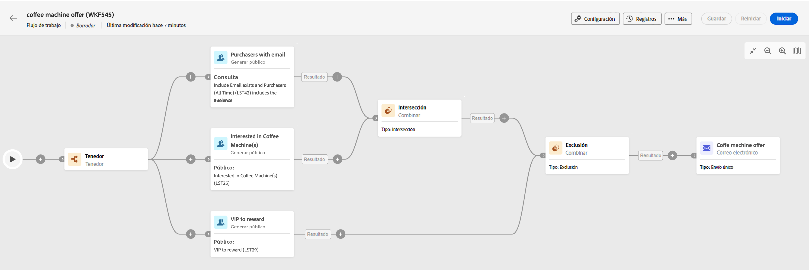

# Organización de actividades {#orchestrate}

Una vez que lo haya hecho [creó un flujo de trabajo](create-workflow.md), ya sea desde el menú de flujo de trabajo o dentro de una campaña, puede empezar a organizar las diferentes tareas que va a realizar. Para ello, se proporciona un lienzo visual, que le permite construir un diagrama de flujo de trabajo. Dentro de este diagrama, puede añadir varias actividades y conectarlas en un orden secuencial.

En esta fase de la configuración, el diagrama se muestra con un icono de inicio que representa el principio del flujo de trabajo. Para añadir la primera actividad, haga clic en el botón + conectado al icono de inicio.

Aparecerá una lista de actividades que se pueden agregar al diagrama. Las actividades disponibles dependen de su posición en el diagrama de flujo de trabajo. Por ejemplo, al añadir la primera actividad de, puede iniciar el flujo de trabajo segmentando una audiencia, dividiendo la ruta del flujo de trabajo o configurando una actividad de espera para retrasar la ejecución del flujo de trabajo. Por otro lado, después de una actividad Generar audiencia, puede refinar el objetivo con actividades de objetivo, enviar una entrega a la audiencia con actividades de canal u organizar el proceso de flujo de trabajo con actividades de control de flujo.

Una vez que se ha agregado una actividad al diagrama, aparece un panel derecho que le permite configurar la actividad recién agregada con ajustes específicos. Encontrará información detallada sobre cómo configurar cada actividad en [esta sección](activities/about-activities.md).

Repita este proceso y agregue tantas actividades como desee según las tareas que desee que realice el flujo de trabajo. Tenga en cuenta que también puede insertar una nueva actividad entre dos actividades. Para ello, haga clic en el botón + de la transición entre las actividades, seleccione la actividad deseada y configúrela en el panel derecho.

Para quitar una actividad, selecciónela en el lienzo y haga clic en el icono Eliminar en las propiedades de la actividad.

>[!TIP]
>
>Tiene la opción de personalizar el nombre de las transiciones entre cada actividad. Para ello, seleccione la transición y cambie su etiqueta en el panel derecho.

VIP A continuación, se muestra un ejemplo de flujo de trabajo diseñado para enviar un correo electrónico a todos los clientes (que no sean clientes de la red) con un correo electrónico que estén interesados en las máquinas de café.

Para ello, se han añadido las actividades siguientes:

* A **[!UICONTROL Tenedor]** actividad que divide el flujo de trabajo en tres rutas (una para cada conjunto de clientes),
* **[!UICONTROL Crear audiencia]** actividades para dirigirse a los tres conjuntos de clientes:

   * Clientes con un correo electrónico,
   * Clientes que pertenecen a la audiencia preexistente &quot;Interesado en las máquinas de café&quot;,
   * VIP Clientes que pertenecen a la audiencia preexistente de &quot;recompensa o&quot;.

* A **[!UICONTROL Combinar]** actividad que agrupa a clientes con un correo electrónico y a aquellos interesados en las máquinas de café,
* A **[!UICONTROL Combinar]** VIP actividad que excluye a los clientes de la,
* Un **[!UICONTROL Envío de correo electrónico]** actividad que envía un correo electrónico a los clientes resultantes.

Una vez completado el flujo de trabajo, añada. **[!UICONTROL Fin]** actividad al final del diagrama. Esta actividad le permite marcar visualmente el final de un flujo de trabajo y no tiene impacto funcional.

Después de diseñar correctamente el diagrama de flujo de trabajo, puede ejecutar el flujo de trabajo y realizar un seguimiento del progreso de sus distintas tareas. [Obtenga información sobre cómo iniciar un flujo de trabajo y monitorizar su ejecución](start-monitor-workflows.md)
