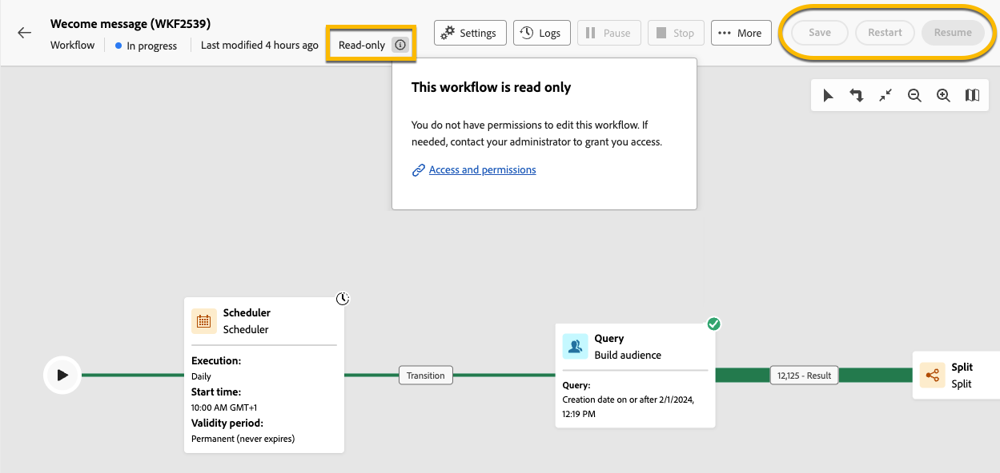

# Acerca de los flujos de trabajo solo de lectura {#readonly-workflows}

>[!CONTEXTUALHELP]
>
Algunos flujos de trabajo son de solo lectura. Los flujos de trabajo técnicos integrados siempre son de solo lectura, pero esta restricción también se puede aplicar a otros tipos de flujos de trabajo.

Es posible que los usuarios de Campaign tengan acceso restringido a los datos de Adobe Campaign. Un administrador de Campaign puede otorgarles el derecho de ver ciertas funciones, pero no de editarlas o modificarlas. Los permisos de usuario sobre los datos son esenciales para garantizar la seguridad de los datos y los procesos. Obtenga más información acerca de la administración de permisos en Campaign en [esta sección](../get-started/permissions.md).

Cuando un flujo de trabajo está en modo de solo lectura:

* La mención **[!UICONTROL Solo lectura]** aparece cerca del botón **[!UICONTROL Configuración]**.
* No se puede acceder a los botones de acción.

{zoomable="yes"}

Los usuarios no pueden editar nada en un flujo de trabajo de solo lectura. No se les permite cambiar la configuración de las actividades.

{zoomable="yes"}

Los usuarios no pueden eliminar el flujo de trabajo.

{zoomable="yes"}

## Tipos de flujos de trabajo de solo lectura {#readonly-workflow-types}

Según el tipo de flujo de trabajo, el modo de solo lectura puede variar.

### Flujos de trabajo de la campaña {#readonly-campaign-wf}

En un flujo de trabajo de campaña de solo lectura, el usuario no puede acceder al botón de monitorización.

{zoomable="yes"}

### Flujos de trabajo técnicos {#readonly-tech-wf}

Los flujos de trabajo técnicos integrados son de solo lectura para todos los usuarios de Campaign, incluidos los administradores. Sin embargo, los usuarios pueden **pausar** o **detenerlos** si es necesario. Estas son las únicas acciones permitidas.

{zoomable="yes"}

Obtenga más información acerca de los flujos de trabajo técnicos en [esta sección](https://experienceleague.adobe.com/en/docs/campaign/automation/workflows/introduction/wf-type/technical-workflows).