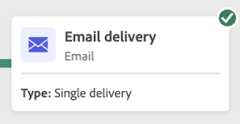

# Inicio y monitorización de flujos de trabajo {#start-monitor}

Una vez creado el flujo de trabajo y diseñado las tareas que se realizan en el lienzo, puede iniciarlo y monitorizar cómo se está ejecutando.

## Inicio del flujo de trabajo {#start}

Para iniciar el flujo de trabajo, vaya a **[!UICONTROL Flujos de trabajo]** para la campaña asociada y haga clic en el **[!UICONTROL Inicio]** en la esquina superior derecha del lienzo.

Una vez que se ejecuta el flujo de trabajo, cada actividad en el lienzo se ejecuta en un orden secuencial, hasta que se llega al final del flujo de trabajo.

Puede realizar un seguimiento del progreso de los perfiles de destino en tiempo real mediante un flujo visual. Esto le permite identificar rápidamente el estado de cada actividad y el número de perfiles en transición entre ellas.

## Transiciones de flujo de trabajo {#transitions}

En los flujos de trabajo, los datos que pasan de una actividad a otra a través de transiciones se almacenan en una tabla de trabajo temporal. Estos datos se pueden mostrar para cada transición. Para ello, seleccione una transición para abrir sus propiedades en el lado derecho de la pantalla.

* Clic **[!UICONTROL Previsualizar esquema]** para mostrar el esquema de la tabla de trabajo.
* Clic **[!UICONTROL Previsualizar resultados]** para visualizar los datos transportados en la transición seleccionada.

## Monitorización de la ejecución de actividades {#activities}

Los indicadores visuales de la esquina superior derecha de cada cuadro de actividad permiten comprobar su ejecución:

| Indicador visual | Descripción |
|-----|------------|
| {width="70%"} | La actividad se está ejecutando. |
| {width="70%"} | La actividad requiere su atención. Esto puede implicar confirmar el envío de una entrega o realizar la acción necesaria. |
| {width="70%"} | La actividad ha encontrado un error. Para resolver el problema, abra los registros de flujo de trabajo para obtener más información. |
| {width="70%"} | La actividad se ha ejecutado correctamente. |

## Monitorización de registros y tareas {#logs-tasks}

La monitorización de registros y tareas de flujos de trabajo es un paso clave para analizar los flujos de trabajo y asegurarse de que se ejecutan correctamente. Se puede acceder a ellas desde **[!UICONTROL Registros]** que está disponible en la barra de herramientas de acciones y en el panel de propiedades de cada actividad.

El **[!UICONTROL Registros y tareas]** proporciona un historial de la ejecución del flujo de trabajo, registrando todas las acciones del usuario y los errores encontrados. Este historial se guarda durante la duración especificada en el flujo de trabajo [opciones de ejecución](workflow-settings.md). Durante esta duración, todos los mensajes se guardan, incluso después de reiniciar el flujo de trabajo. Si no desea guardar los mensajes de una ejecución anterior, haga clic en el **[!UICONTROL Purge history]** botón.

Hay dos tipos de información disponibles:

* El **[!UICONTROL Registro]** contiene el historial de ejecución de todas las actividades de flujo de trabajo. Indexa las operaciones realizadas y los errores de ejecución por orden cronológico.
* El **[!UICONTROL Tareas]** La pestaña detalla la secuencia de ejecución de las actividades.

En ambas pestañas, puede elegir las columnas mostradas y su orden, aplicar filtros y utilizar el campo de búsqueda para encontrar rápidamente la información deseada.

## Comandos de ejecución de flujo de trabajo {#execution-commands}

La barra de acciones de la esquina superior derecha proporciona comandos que le permiten administrar la ejecución del flujo de trabajo. Puede hacer lo siguiente:

* **[!UICONTROL Inicio]** / **[!UICONTROL Reanudar]** la ejecución del flujo de trabajo, que luego adquiere el estado En curso. Si el flujo de trabajo estaba en pausa, se reanuda, pero de lo contrario se inicia y las actividades iniciales se activan.

* **[!UICONTROL Pausar]** la ejecución del flujo de trabajo, que luego adquiere el estado Paused. No se activará ninguna actividad nueva hasta que se reanude, pero las operaciones en curso no se suspenden.

* **[!UICONTROL Detener]** un flujo de trabajo que se está ejecutando y que, a continuación, pasará al estado Finished. Las operaciones en curso se interrumpen si es posible. No puede reanudar desde el flujo de trabajo desde el mismo lugar en el que se detuvo.
