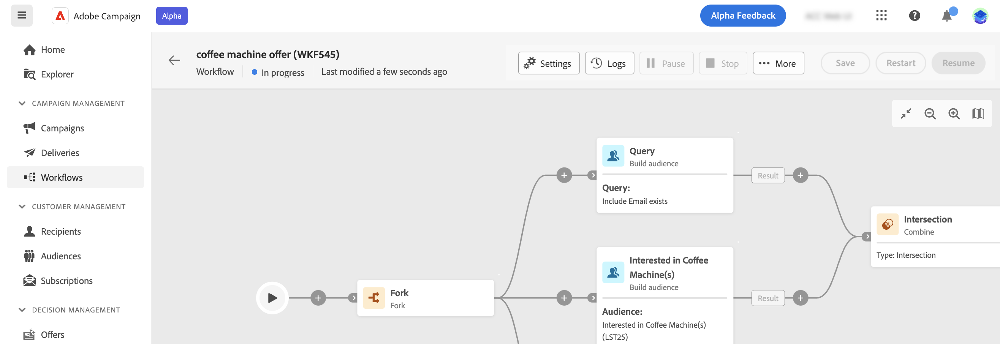

# Configuración avanzada del flujo de trabajo {#workflow-settings}

Al organizar actividades de flujo de trabajo en el lienzo, puede acceder a la configuración avanzada relacionada con el flujo de trabajo. Por ejemplo, puede establecer una zona horaria específica para el flujo de trabajo, administrar cómo debe comportarse el flujo de trabajo en caso de error o administrar el retraso tras el cual debe purgarse el historial del flujo de trabajo.

Para ello, haga clic en el **[!UICONTROL Configuración de flujo de trabajo]** en la esquina superior izquierda del lienzo, junto a la etiqueta del flujo de trabajo.

## Propiedades del flujo de trabajo {#properties}

>[!CONTEXTUALHELP]
>id="acw_workflow_settings_properties"
>title="Propiedades del flujo de trabajo"
>abstract="Por determinar"

La sección de propiedades del flujo de trabajo proporciona propiedades genéricas a las que también se puede acceder al crear el flujo de trabajo.

* **[!UICONTROL Etiqueta]**: etiqueta del flujo de trabajo que se muestra en la lista.
* **[!UICONTROL Nombre interno]**: nombre interno del flujo de trabajo.
* **[!UICONTROL Carpeta]**: Carpeta en la que se debe guardar el flujo de trabajo.
* **[!UICONTROL Campaña vinculada]**: Este campo se muestra si el flujo de trabajo se ha creado dentro de una campaña. Permite abrir la campaña asociada.
* **[!UICONTROL Timezone]**: Defina una zona horaria específica para utilizarla de forma predeterminada en todas las actividades del flujo de trabajo. De forma predeterminada, el huso horario del flujo de trabajo es el definido para el operador de Campaign actual.
* **[!UICONTROL Supervisor]**: Cuando un flujo de trabajo da error, se notifica por correo electrónico a los operadores que pertenecen al grupo de supervisión del flujo de trabajo, siempre y cuando su dirección de correo electrónico se muestre en su perfil.
* **[!UICONTROL Descripción]**: Utilice este campo para proporcionar una descripción del flujo de trabajo.

## Configuración de segmentación

>[!CONTEXTUALHELP]
>id="acw_workflow_settings_segmentation"
>title="Configuración de segmentación"
>abstract="Por determinar"

* **[!UICONTROL Dimensión de segmentación]**: Seleccione la dimensión de segmentación que se utilizará para segmentar los perfiles: destinatarios, beneficiarios de contratos, operadores, suscriptores, etc.
* **[!UICONTROL Mantener el resultado de poblaciones provisionales entre dos ejecuciones]**: De forma predeterminada, solo se conservan las tablas de trabajo de la última ejecución del flujo de trabajo. Las tablas de trabajo de ejecuciones anteriores se depuran mediante un flujo de trabajo técnico, que se ejecuta diariamente.

   Si esta opción está activada, las tablas de trabajo se conservarán incluso después de ejecutar el flujo de trabajo. Puede utilizarlo con fines de prueba y, por lo tanto, solo debe usarse en entornos de desarrollo o ensayo. Nunca se debe comprobar en un flujo de trabajo de producción,

## Configuración de ejecución del flujo de trabajo

>[!CONTEXTUALHELP]
>id="acw_workflow_settings_execution"
>title="Configuración de ejecución"
>abstract="Por determinar"

* Historial en días: las tablas de trabajo de la base de datos mantienen un historial de ejecuciones (tareas, eventos, registro). Aquí puede definir el número de días que desea archivar para este flujo de trabajo: una vez al día, el proceso de limpieza elimina los archivos más antiguos. Si el valor de este campo es cero, el archivo no se elimina nunca.

   especifica el número de días después de los cuales se debe purgar el historial. El historial contiene elementos relacionados con el flujo de trabajo: registros, tareas, eventos (objetos técnicos vinculados al funcionamiento del flujo de trabajo), así como archivos descargados por la actividad **[!UICONTROL Transferir archivo]**. El valor predeterminado es de 30 días para las plantillas de flujo de trabajo integradas.

   La depuración del historial se realiza mediante el flujo de trabajo de limpieza de la base de datos técnico, que se ejecuta de forma predeterminada todos los días.

   >[!IMPORTANT]
   >
   >Si el campo **[!UICONTROL Historial en días]** se deja en blanco, su valor se considerará “1”, lo que significa que el historial se purgará después de un día.

* Afinidad predeterminada: este campo permite forzar un flujo de trabajo o una actividad de flujo de trabajo para que se ejecute en un equipo en particular.   Si su instalación incluye varios servidores de flujo de trabajo, utilice este campo para elegir el equipo en el que desea ejecutar el flujo de trabajo. Si el valor introducido en este campo no existe en ningún servidor, el flujo de trabajo se mantiene pendiente.

* Guardar consultas SQL en el registro: permite guardar las consultas SQL del flujo de trabajo en los registros. (¿dónde acceder a los registros SQL?)

   Esta funcionalidad se reserva únicamente a los usuarios avanzados. Afecta a los flujos de trabajo que incluyen actividades de objetivos (consulta, unión, intersección, etc.). Cuando se activa esta opción, las consultas SQL enviadas a la base de datos durante la ejecución del flujo de trabajo se muestran en Adobe Campaign: esto significa que puede revisarlas para optimizar consultas o diagnosticar problemas.

   Las consultas se muestran en una pestaña **[!UICONTROL SQL logs]** que se añade al flujo de trabajo (excepto a los flujos de trabajo de la campaña) y a la actividad **[!UICONTROL Properties]** cuando la opción está activada. La pestaña **[!UICONTROL Audit]** también incluye consultas SQL.

## Configuración de administración de errores

>[!CONTEXTUALHELP]
>id="acw_workflow_settings_error"
>title="Configuración de administración de errores"
>abstract="Por determinar"

* Este campo permite definir las acciones que se deben llevar a cabo si una tarea de flujo de trabajo presenta errores. Hay dos opciones posibles:

   Detener el proceso: el flujo de trabajo se pone en pausa automáticamente. El estado del proceso cambia a Error. Una vez resuelto el problema, reinicie el flujo de trabajo con los botones Iniciar o Reiniciar.

   Ignorar: el estado de la tarea que activó el error cambia a Error, pero el flujo de trabajo mantiene el estado Iniciado. Esta configuración es importante para tareas recurrentes: si la rama incluye un planificador, la próxima vez que se ejecute el flujo de trabajo se inicia de forma normal.

* Errores consecutivos: este campo está disponible cuando el valor Ignore está seleccionado en el campo En caso de errores. Puede especificar el número de errores que se pueden omitir antes de que se detenga el proceso. Una vez alcanzado este número, el estado del flujo de trabajo cambia a Error. Si el valor de este campo es 0, el flujo de trabajo nunca se detiene, independientemente del número de errores.
